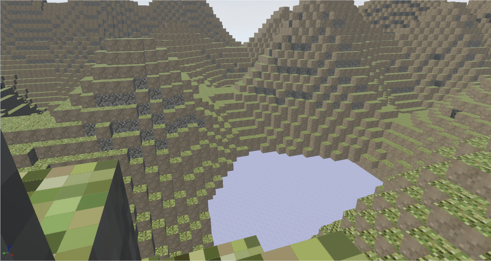
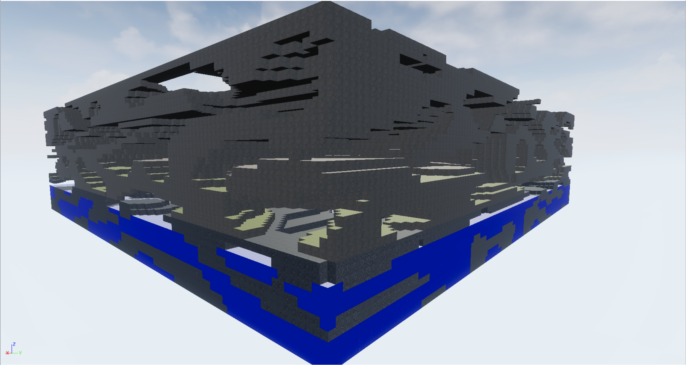
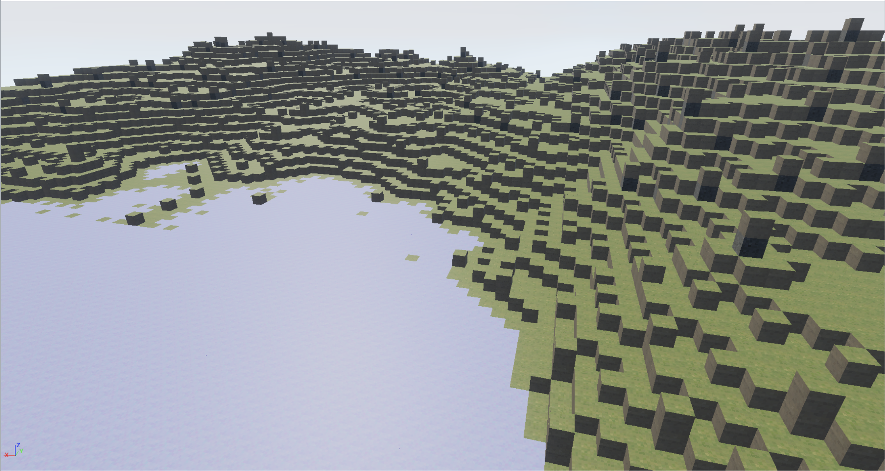

# Procedural brick wall and Minecraft-like terrain for UE4

## Hierarchy

* ```Actor``` (Build in UE4)
  * ```AProceduralBlockBase```
    * ```AProceduralBlockBase2D```
      * ```AProceduralWall```
        * ```AProceduralWallWithObject```
    * ```AProceduralBlockBase3D```
      * ```TerrainChunk```
  * ```AProceduralTerrain```
  * ```AProceduralBuilding```

## The procedural wall

Class ```AProceduralWall```

Features:

* Could be "destroyed" using 1D Perlin Noise or/and random circles cutting
  * [Perlin Noise library](https://github.com/Reputeless/PerlinNoise.git)
* Editable size of brick
* High perfomance (one brick instance represents all wall)
* Optional offset by a half of brick length (in brickwork style)

Class ```AProceduralWallWithObject```

Features:

* Create a hole for build in the wall object like window or door
* Uses block and object sizes for calculating a hole size

## The terrain

Based on `AProceduralBlockBase`, the Minecraft-like terrain was done.

Terrain is generates using:
 
* Perlin Noise 2D
* Perlin Noise 3D
* Diamond Square
* Build-in caves system (Mix of Perlin Noise 2D and 3D, See `presentation.pdf`)

Terrain consis of `TerrainChunk`'s

### Perlin Noise 2D



### Perlin Noise 3D



### Diamond Square

